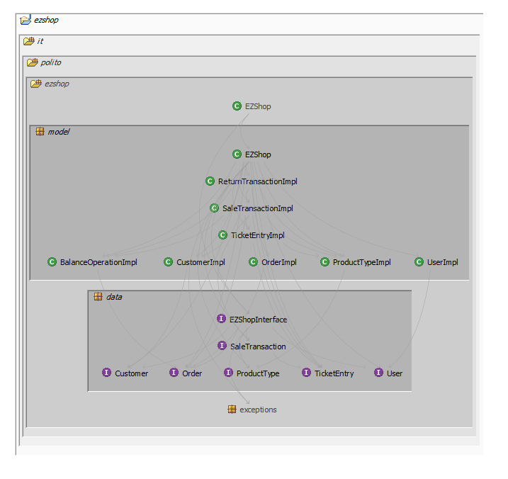
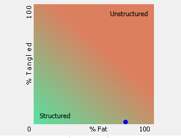
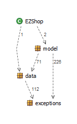

# Design assessment

Authors: Jose Antonio Antona Diaz, Giuseppe D'Andrea, Marco Riggio, Gioele Scaletta

Date: 02/06/2021

Version: 1.0

# Levelized structure map

# Structural over complexity chart

# Size metrics

| Metric                                    | Measure |
| ----------------------------------------- | ------- |
| Packages                                  |    6     |
| Classes (outer)                           |    37    |
| Classes (all)                             |    73    |
| NI (number of bytecode instructions)      |    14K    |
| LOC (non comment non blank lines of code) |     6K   |

# Items with XS

| Item | Tangled | Fat  | Size | XS   |
| ---- | ------- | ---- | ---- | ---- |
| ezshop.it.polito.ezshop.model.EZShop	| | 	153	| 11490| 	2478| 
| ezshop.it.polito.ezshop.model.EZShop.reset():void	| | 	82	| 485| 	396| 
| ezshop.it.polito.ezshop.model.EZShop.recordOrderArrival(java.lang.Integer):boolean	| | 	56| 	388	| 284| 
| ezshop.it.polito.ezshop.model.EZShop.payOrderFor(java.lang.String, int, double):java.lang.Integer	| | 	43| 	354| 	230| 
| ezshop.it.polito.ezshop.model.EZShop.createProductType(java.lang.String, java.lang.String, double, java.lang.String):java.lang.Integer	| | 	42	| 311	| 199| 
| ezshop.it.polito.ezshop.model.EZShop.updatePersistenceReturnTransaction(it.polito.ezshop.model.ReturnTransactionImpl):boolean	| | 	32| 	358| 	190| 
| ezshop.it.polito.ezshop.model.EZShop.issueOrder(java.lang.String, int, double):java.lang.Integer	| | 	40| 	301	| 188| 
| ezshop.it.polito.ezshop.model.EZShop.createUser(java.lang.String, java.lang.String, java.lang.String):java.lang.Integer| | 		40	| 287| 	179| 
| ezshop.it.polito.ezshop.model.EZShop.updatePersistenceSaleTransactionQuantity(it.polito.ezshop.model.SaleTransactionImpl):boolean	| | 	30| 	339| 	169| 
| ezshop.it.polito.ezshop.model.EZShop.modifyCustomer(java.lang.Integer, java.lang.String, java.lang.String):boolean| | 		36	| 259	| 151| 
| ezshop.it.polito.ezshop.model.EZShop.updateQuantity(java.lang.Integer, int):boolean	| | 	31	| 290| 	149| 
| ezshop.it.polito.ezshop.model.EZShop.updateProduct(java.lang.Integer, java.lang.String, java.lang.String, double, java.lang.String):boolean	| | 	35	| 253| 	144| 
|ezshop.it.polito.ezshop.model.EZShop.payOrder(java.lang.Integer):boolean | |		34	|252	|140|
|ezshop.it.polito.ezshop.model.EZShop.updatePosition(java.lang.Integer, java.lang.String):boolean| |		32|	253|	134|
|ezshop.it.polito.ezshop.model.EZShop.insertPersistenceReturnTransaction(it.polito.ezshop.model.ReturnTransactionImpl):java.lang.Integer| |		25|	278|	111|
|ezshop.it.polito.ezshop.model.EZShop.getReturnTransactionById(java.lang.Integer):it.polito.ezshop.model.ReturnTransactionImpl	| |	21|	229	|65|
|ezshop.it.polito.ezshop.model.EZShop.login(java.lang.String, java.lang.String):it.polito.ezshop.data.User| |		22|	178|	56|
| ezshop.it.polito.ezshop.model.EZShop.attachCardToCustomer(java.lang.String, java.lang.Integer):boolean	| | 	23| 	138| 	48| 
| ezshop.it.polito.ezshop.model.EZShop.modifyPointsOnCard(java.lang.String, int):boolean	| | 	22| 	146| 	46| 
| ezshop.it.polito.ezshop.model.EZShop.deletePersistenceReturnTransaction(it.polito.ezshop.model.ReturnTransactionImpl):boolean	| | 	19	| 203	| 42| 
| ezshop.it.polito.ezshop.model.EZShop.getUser(java.lang.Integer):it.polito.ezshop.data.User |	|	20|	150|	37|
| ezshop.it.polito.ezshop.model.EZShop.getBalanceOperationByDate(java.time.LocalDate, java.time.LocalDate):java.util.List|	|	19|	177|	37|
| ezshop.it.polito.ezshop.model.EZShop.getProductTypeByCode(java.lang.String):it.polito.ezshop.model.ProductTypeImpl |	|	18|	209|	34|
| ezshop.it.polito.ezshop.model.EZShop.lambda$SaleConfirmedEnsurePersistence$2(java.lang.Integer, it.polito.ezshop.data.TicketEntry):void|	|	19|	146|	30|
| ezshop.it.polito.ezshop.model.EZShop.defineCustomer(java.lang.String):java.lang.Integer |	|19	|142	|29|
| ezshop.it.polito.ezshop.model.EZShop.updateUserRights(java.lang.Integer, java.lang.String):boolean|	|	17|	134|	15|
| ezshop.it.polito.ezshop.model.EZShop.deleteCustomer(java.lang.Integer):boolean|	|	17|	106|	12|
| ezshop.it.polito.ezshop.model.EZShop.deleteUser(java.lang.Integer):boolean	|	|16	|122	|7|
| ezshop.it.polito.ezshop.model.EZShop.getCustomer(java.lang.Integer):it.polito.ezshop.model.CustomerImpl|	|	16|	96|	6|

# Package level tangles

# Summary analysis

Here is a brief summary of the relevant differences between the design document and the actual project structure:

- EZShop class now belongs to the model package. 
- A small amount of methods has been added to the EZShop class to better manage operations.
- LoyaltyCard class has been removed and merged with the Customer class to reduce overhead.

The project doesn't present any tangle between its components.
The major issue that the project actually has is relative to the "fatness" of the EZShop class. A possible solution may be
refactoring the EZShop class by splitting its functionalities in a DB API in charge of retrieving and updating data with
the adequate queries, and the logic of the EZShop.