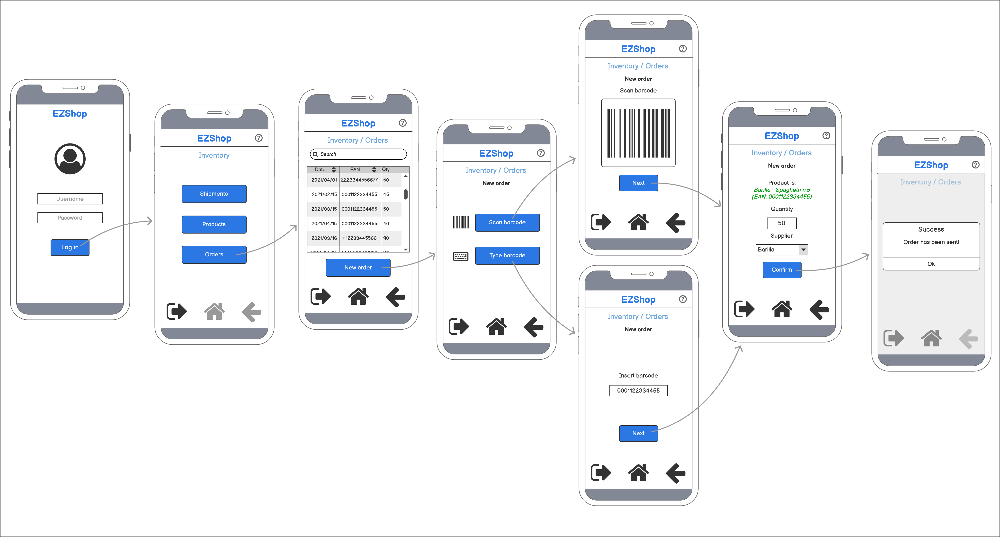
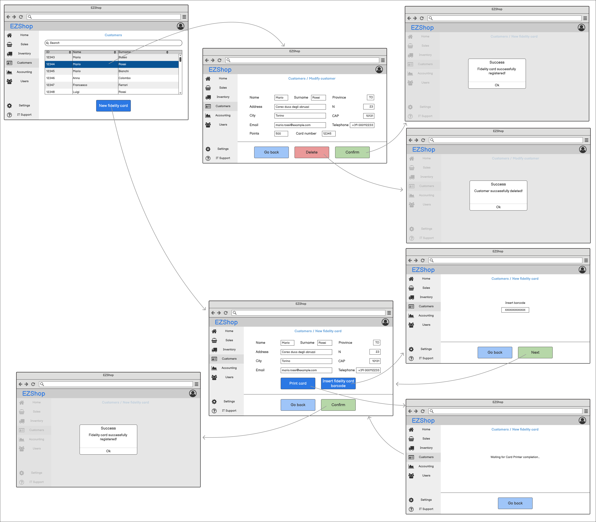

# Graphical User Interface Prototype  

Authors: Jose Antonio Antona Diaz, Giuseppe D'Andrea, Marco Riggio, Gioele Scaletta

Date: 21/04/2021

Version: 0.1

## Use Case 1 - Authenticate a user

## Use Case 2/3 - Manage a user

## Use Case 4 - Manage sales

## Use Case 5 - Register incoming shipment

## Use Case 6 - Product information management

## Use Case 7 - Order products

## Use Case 8 - Manage customers

## Use Case 9 - Authenticate a user

