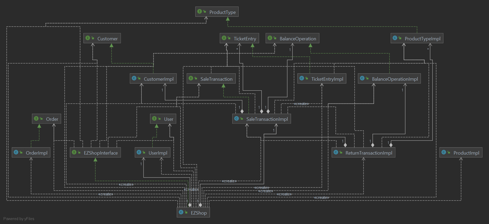

# Integration and API Test Documentation

Authors:

Date:

Version:

# Contents

- [Dependency graph](#dependency graph)

- [Integration approach](#integration)

- [Tests](#tests)

- [Scenarios](#scenarios)

- [Coverage of scenarios and FR](#scenario-coverage)
- [Coverage of non-functional requirements](#nfr-coverage)
 


# Dependency graph 

     <report the here the dependency graph of the classes in EzShop, using plantuml>

```plantuml

package "EZShop" 
{

    package "data-step3"{

        class EZShop
        interface "EZShopInterface"
        interface "Customer"
        interface "BalanceOperation"
        interface "Order"
        interface "ProductType"
        interface "SaleTransaction"
        interface "TicketEntry"
        interface "User"

        EZShopInterface  -down-> EZShop
        EZShop -down-> Customer
        EZShop -down-> BalanceOperation
        EZShop -down-> Order
        EZShop -down-> ProductType
        EZShop -down-> SaleTransaction
        EZShop -down-> TicketEntry
        EZShop -down-> User

    }

    package "model-step2"{

        package "model-step1" {
        class "CustomerImpl"
        class "BalanceOperationImpl"
        class "OrderImpl"
        class "ProductTypeImpl"  
        class "TicketEntryImpl"
        class "UserImpl"
        
        
        
        }
         class "SaleTransactionImpl"
        class "ReturnTransactionImpl"

        Customer -down-> CustomerImpl
        BalanceOperation -down-> BalanceOperationImpl
        Order -down-> OrderImpl
        ProductType -down-> ProductTypeImpl
        SaleTransaction -down-> SaleTransactionImpl
        TicketEntry -down-> TicketEntryImpl
        User -down-> UserImpl
    }

    ReturnTransactionImpl -> BalanceOperationImpl
    ReturnTransactionImpl -> SaleTransactionImpl
    ReturnTransactionImpl -> ProductTypeImpl
    SaleTransactionImpl -down-> BalanceOperationImpl
    SaleTransactionImpl -down-> TicketEntryImpl
    SaleTransactionImpl -down-> CustomerImpl
    SaleTransactionImpl -down-> ProductTypeImpl
    TicketEntryImpl -> ProductTypeImpl

}

```


     
# Integration approach

   We adopted a bottom-up integration testing strategy:
    step 1: Unit testing
    step 2: Integration testing (always classes in the model package but with dependecies)
    step 3: API and Integration testing (methods in EZShop class)

#  Tests

   <define below a table for each integration step. For each integration step report the group of classes under test, and the names of
     JUnit test cases applied to them> JUnit test classes should be here src/test/java/it/polito/ezshop

## Step 1 - Unit testing
| Classes  | JUnit test cases |
|--|--|
|model.OrderImpl|unitTest.testOrderImpl|
|model.UserImpl|unitTest.testUserImpl|
|model.ProductTypeImpl|unitTest.testProductTypeImpl|
|model.BalanceOperationImpl|unitTest.testBalanceOperationImpl|
|model.TicketEntryImpl|unitTest.testTicketEntryImpl|
|model.SaleTransactionImpl|unitTest.testSaleTransactionImpl|
|model.ReturnTransactionImpl|unitTest.testReturnTransactionImpl|
|model.testCustomerImpl|unitTest.testCustomerImpl|

## Step 2 - Model classes part of integration testing
| Classes  | JUnit test cases |
|--|--|
|SaleTransactionImpl|integrationTest.TestIntegrationSaleTransactionImpl|
|ReturnTransactionImpl|integrationTest.testIntegrationReturnTransactionImpl|

## Step 3 -API test
| Classes  | JUnit test cases |
|--|--|
|EZShop|integrationTest.TestIntegrationEzShop|


# Scenarios


<If needed, define here additional scenarios for the application. Scenarios should be named
 referring the UC in the OfficialRequirements that they detail>

##### Scenario UC1.4 Delete product

| Scenario |  Delete product type |
| ------------- |:-------------:| 
|  Precondition     | Employee C exists and is logged in |
|  | Product type X exists |
|  Post condition     | X deleted |
| Step#        | Description  |
|  1    |  C searches X via bar code |
|  2    |  C selects X's record |
|  3    |  C deletes X |
|  4   |  C confirms the update |

##### Scenario UC1.5 Get List of products

| Scenario |  List product types |
| ------------- |:-------------:| 
|  Precondition     | Employee C exists and is logged in |
|  | Product list is not empty |
|  Post condition     | list returned |
| Step#        | Description  |
|  1    |  C requests list of products|
|  2    |  C receives list of products |

##### Scenario UC1.6 Search a product

| Scenario |  List product types |
| ------------- |:-------------:| 
|  Precondition     | Employee C exists and is logged in |
|  | Product list is not empty |
|  Post condition     | list returned |
| Step#        | Description  |
|  1    |  C inserts barcode of product to be searched |
|1| C inserts the description (or part of it) of the products he is looking for |
|  2    |  C receives the product/products |

##### Scenario UC2.4 Get list of Users

| Scenario |  List Users |
| ------------- |:-------------:| 
|  Precondition     | Employee C exists and is logged in |
|  | Users list is not empty |
|  Post condition     | list returned |
| Step#        | Description  |
|  1    |  C requests list of users|
|  2    |  C receives list of users |

##### Scenario UC2.5 Search a user

| Scenario |  List product types |
| ------------- |:-------------:| 
|  Precondition     | Employee C exists and is logged in |
|  | Users list  is not empty |
|  Post condition     | list returned |
| Step#        | Description  |
|  1    |  C inserts id of user to be searched |
|  2    |  C receives the user |

##### Scenario UC3.4 Update product Quantity

| Scenario |  Delete product type |
| ------------- |:-------------:| 
|  Precondition     | Employee C exists and is logged in |
|  | Product type X exists |
|  Post condition     | X quantity updated |
| Step#        | Description  |
|  1    |  C searches X via bar code |
|  2    |  C selects X's record |
|  3    |  C modifies X's quantity |
|  4   |  C confirms the update |

##### Scenario UC3.5 Get lists of Orders

| Scenario |  List Orders |
| ------------- |:-------------:| 
|  Precondition     | Employee C exists and is logged in |
|  | Orders list is not empty |
|  Post condition     | list returned |
| Step#        | Description  |
|  1    |  C requests list of orders|
|  2    |  C receives list of orders |

##### Scenario UC4.5

| Scenario |  Delete customer record |
| ------------- |:-------------:| 
|  Precondition     | Account U for customer Cu existing |
|  Post condition     | Account U for customer Cu not existing |
| Step#        | Description  |
|  1    | User selects customer record U |
|  2    | U is deleted |

##### Scenario UC4.6

| Scenario |  List all customer records |
| ------------- |:-------------:| 
|  Precondition     | Customers list is not empty |
|  Post condition     | Customer list returned |
| Step#        | Description  |
|  1    | User requests list of customers |
|  2    | User receives list of customers |

##### Scenario UC4.7

| Scenario |  Modify points on a Loyalty card |
| ------------- |:-------------:| 
|  Precondition     | Account U for customer Cu existing |
|  | Loyalty card L attached to U |
|  Post condition     | Points on a Loyalty card L modified |
| Step#        | Description  |
|  1    |  User selects customer record U |
|  2    |  User modify points on L |

##### Scenario 6-7

| Scenario |  Remove product type X from sale |
| ------------- |:-------------:| 
|  Precondition     | Cashier C exists and is logged in |
| | Product type X exists and is in the sale |
|  Post condition     | Balance += N*X.unitPrice  |
| | X.quantity -= N |
| Step#        | Description  |
|  1    |  C starts a new sale transaction |  
|  2    |  C reads bar code of X |
|  3    |  C removes N units of X to the sale |
|  4    |  X available quantity is increased by N |
|  5    |  C closes the sale transaction |
|  6    |  System asks payment type |
|  7    |  Manage  payment (see UC7) |
|  8    |  Payment successful |
|  9    |  C confirms the sale and prints the sale receipt |
|  10   |  Balance is updated |

##### Scenario 8-3

| Scenario |  Return of product type X cancelled |
| ------------- |:-------------:| 
|  Precondition     | Cashier C exists and is logged in |
| | Product type X exists and has enough units to complete the return |
| | Transaction T exists and has at least N units of X
|  Post condition     | Balance not changed  |
| | X.quantity not changed |
| Step#        | Description  |
|  1    |  C inserts T.transactionId |
|  2    |  Return transaction starts |  
|  3    |  C reads bar code of X |
|  4    |  C adds N units of X to the return transaction |
|  5    |  X available quantity is increased by N |
|  6    |  C closes the return transaction |
|  8    |  Return transaction aborted, no change will be recorded|

##### Scenario UC9.2

| Scenario |  Credit operation |
| ------------- |:-------------:| 
|  Precondition     | Employee C exists and is logged in |
|  | Sale operation O has occurred |
|  Post condition     | A Balance operation has been added to the application |
| Step#        | Description  |
|  1    |  The amount T (where T>0) of the operation O is calculated |
|  2    |  A Balance operation B with amount T is created |
|  3    |  B is added to the list of balance operations of the application |

##### Scenario UC9.3

| Scenario |  Debit operation |
| ------------- |:-------------:| 
|  Precondition     | Employee C exists and is logged in |
|  | Order/Return operation O has occurred |
|  Post condition     | A Balance operation has been added to the application |
| Step#        | Description  |
|  1    |  The amount T (where T<0)of the operation O is calculated |
|  2    |  A Balance operation B with amount T is created |
|  3    |  B is added to the list of balance operations of the application |

##### Scenario UC9.4

| Scenario |  Compute Balance |
| ------------- |:-------------:| 
|  Precondition     | Employee C exists and is logged in |
|  | Sale/Order/Return operation O has occurred |
|  Post condition     | Total Balance is Computed |
| Step#        | Description  |
|  1    |  Retrieve balance operation |
|  2    |  Retrieve amount of each balance operation and sum |
|  3    |  Return sum |


# Coverage of Scenarios and FR


<Report in the following table the coverage of  scenarios (from official requirements and from above) vs FR. 
Report also for each of the scenarios the (one or more) API JUnit tests that cover it. >


| Scenario ID | Functional Requirements covered | JUnit  Test(s) | 
| ----------- | ------------------------------- | ----------- | 
|1.1|FR3.1|TestIntegrationEZShop.testCreateProductType()|
|1.2|FR4.2|TestIntegrationEZShop.testUpdatePosition()|
|1.3|"|TestIntegrationEZShop.testUpdateProduct()|
|1.4|FR3.2|TestIntegrationEZShop.testDeleteProductType()|
|1.5|FR3.3|TestIntegrationEZShop.testGetAllProductTypes()|
|1.6|FR3.4|TestIntegrationEZShop.testGetProductTypeByBarCode()|
|"|"|TestIntegrationEZShop.testGetProductByDescription()|
|2.1|FR1.1|TestIntegrationEZShop.testCreateUser()|
|2.2|FR1.2|TestIntegrationEZShop.testDeleteUser()|
|2.3|FR1.5|TestIntegrationEZShop.testUpdateUserRights()|
|2.4|FR1.3|TestIntegrationEZShop.testGetAllUsers()|
|2.5|FR1.4|TestIntegrationEZShop.testGetUser()|
|3.1|FR4.3|TestIntegrationEZShop.testIssueOrder()|
|3.2|FR4.4|TestIntegrationEZShop.testPayOrderFor()|
|"|FR4.5|TestIntegrationEZShop.testPayOrder()|
|3.3|FR4.6|TestIntegrationEZShop.testRecordOrderArrival()|
|3.4|FR4.1|TestIntegrationEZShop.testUpdateQuantity()|
|3.5|FR4.7|TestIntegrationEZShop.testGetAllOrders()|
|4.1|FR5.1|TestIntegrationEZShop.testDefineCustomer()|
|4.2|FR5.5|TestIntegrationEZShop.testCreateCard()|
|"|FR5.6|TestIntegrationEZShop.testAttachCardToCustomer()|
|4.3|FR5.3|TestIntegrationEZShop.testGetCustomer()|
|"|FR5.1|TestIntegrationEZShop.testModifyCustomer()|
|4.4|FR5.3|TestIntegrationEZShop.testGetCustomer()|
|"|FR5.1|TestIntegrationEZShop.testModifyCustomer()|
|4.5|FR5.2|TestIntegrationEZShop.testDeleteCustomer()|
|4.6|FR5.4|TestIntegrationEZShop.testGetAllCustomers()|
|4.7|FR5.7|TestIntegrationEZShop.testModifyPointsOnCard()|
|5.1|FR1.5|TestIntegrationEZShop.testLogin()|
|5.2|"|TestIntegrationEZShop.testLogout()|
|6.1|FR6.1|TestIntegrationEZShop.testStartSaleTransaction()|
|"|FR6.7|TestIntegrationEZShop.getProductTypeByBarCode()|
|"|FR6.2|TestIntegrationEZShop.testAddProductToSale()|
|"|FR6.10|TestIntegrationEZShop.testEndSaleTransaction()|
|"|FR7.1/FR7.2|TestIntegrationEZShop.testReceiveCashPayment()/testReceiveCreditCardPayment|
|6.2|FR6.1|TestIntegrationEZShop.testStartSaleTransaction()|
|"|FR6.7|TestIntegrationEZShop.getProductTypeByBarCode()|
|"|FR6.2|TestIntegrationEZShop.testAddProductToSale()|
|"|FR6.5|TestIntegrationEZShop.testApplyDiscountRateToProduct()|
|"|FR6.10|TestIntegrationEZShop.testEndSaleTransaction()|
|"|FR7.1/FR7.2|TestIntegrationEZShop.testReceiveCashPayment()/testReceiveCreditCardPayment|
|6.3|FR6.1|TestIntegrationEZShop.testStartSaleTransaction()|
|"|FR6.7|TestIntegrationEZShop.getProductTypeByBarCode()|
|"|FR6.2|TestIntegrationEZShop.testAddProductToSale()|
|"|FR6.4|TestIntegrationEZShop.testApplyDiscountRateToSale()|
|"|FR6.10|TestIntegrationEZShop.testEndSaleTransaction()|
|"|FR7.1/FR7.2|TestIntegrationEZShop.testReceiveCashPayment()/testReceiveCreditCardPayment|
|6.4|FR6.1|TestIntegrationEZShop.testStartSaleTransaction()|
|"|FR6.7|TestIntegrationEZShop.getProductTypeByBarCode()|
|"|FR6.2|TestIntegrationEZShop.testAddProductToSale()|
|"|FR6.10|TestIntegrationEZShop.testEndSaleTransaction()|
|"|FR6.6|TestIntegrationEZShop.testComputePointsForSale()|
|"|FR7.2|TestIntegrationEZShop.testReceiveCashPayment()|
|6.5|FR6.1|TestIntegrationEZShop.testStartSaleTransaction()|
|"|FR6.7|TestIntegrationEZShop.getProductTypeByBarCode()|
|"|FR6.2|TestIntegrationEZShop.testAddProductToSale()|
|"|FR6.10|TestIntegrationEZShop.testEndSaleTransaction()|
|"|FR6.11|TestIntegrationEZShop.testDeleteSaleTransaction()|
|6.6|FR6.1|TestIntegrationEZShop.testStartSaleTransaction()|
|"|FR6.7|TestIntegrationEZShop.getProductTypeByBarCode()|
|"|FR6.2|TestIntegrationEZShop.testAddProductToSale()|
|"|FR6.10|TestIntegrationEZShop.testEndSaleTransaction()|
|"|FR7.1/FR7.2|TestIntegrationEZShop.testReceiveCashPayment()/testReceiveCreditCardPayment|
|6.7|FR6.1|TestIntegrationEZShop.testStartSaleTransaction()|
|"|FR6.7|TestIntegrationEZShop.getProductTypeByBarCode()|
|"|FR6.2|TestIntegrationEZShop.testDeleteProductFromSale()|
|"|FR6.10|TestIntegrationEZShop.testEndSaleTransaction()|
|"|FR7.1/FR7.2|TestIntegrationEZShop.testReceiveCashPayment()/testReceiveCreditCardPayment|
|7.1|FR7.2|TestIntegrationEZShop.testReceiveCreditCardPayment()|
|7.2|"|TestIntegrationEZShop.testReceiveCreditCardPayment()|
|7.3|"|TestIntegrationEZShop.testReceiveCreditCardPayment()|
|7.4|FR7.1|TestIntegrationEZShop.testReceiveCashPayment()|
|8.1|FR6.12|TestIntegrationEZShop.testStartReturnTransaction()|
|"|FR6.13|TestIntegrationEZShop.testReturnProduct()|
|"|FR6.14|TestIntegrationEZShop.testEndReturnTransaction()|
|"|FR7.4|TestIntegrationEZShop.testReturnCreditCardPayment()|
|8.2|FR6.12|TestIntegrationEZShop.testStartReturnTransaction()|
|"|FR6.13|TestIntegrationEZShop.testReturnProduct()|
|"|FR6.14|TestIntegrationEZShop.testEndReturnTransaction()|
|"|FR7.3|TestIntegrationEZShop.testReturnCashPayment()|
|8.3|FR6.12|TestIntegrationEZShop.testStartReturnTransaction()|
|"|FR6.13|TestIntegrationEZShop.testReturnProduct()|
|"|FR6.14|TestIntegrationEZShop.testEndReturnTransaction()|
|"|FR6.15|TestIntegrationEZShop.testDeleteReturnTransaction()|
|9.1|FR8.3|TestIntegrationEZShop.testGetDebitsAndCredits()|
|9.2|FR8.2|TestIntegrationEZShop.testRecordBalanceUpdate()|
|9.3|FR8.1|TestIntegrationEZShop.testRecordBalanceUpdate()|
|9.4|FR8.4|TestIntegrationEZShop.testRecordBalanceUpdate()|
|10.1|FR7.4|TestIntegrationEZShop.testReturnCreditCardPayment()|
|10.2|FR7.3|TestIntegrationEZShop.testReturnCashPayment()|


# Coverage of Non Functional Requirements


<Report in the following table the coverage of the Non Functional Requirements of the application - only those that can be tested with automated testing frameworks.>


### 

| Non Functional Requirement | Test name |
| -------------------------- | --------- |
|  NFR2                      |  TestNFR.testTimeLogin()   |
|                            |  TestNFR.testTimeLogout()   |
|                            |  TestNFR.testTimeCreateDeleteUser()   |
|                            |  TestNFR.testTimeGetUsers()   |
|                            |  TestNFR.testTimeUpdateUserRights()   |
|                            |  TestNFR.testTimeCreateUpdateDeleteProductType()   |
|                            |  TestNFR.testTimeGetProductTypes()   |
|                            |  TestNFR.testTimeUpdateProduct()   |
|                            |  TestNFR.testTimeOrders()   |
|                            |  TestNFR.testTimeRecordBalanceUpdate()   |
|                            |  TestNFR.testTimeGetCreditsAndDebits()   |
|                            |  TestNFR.testComputeBalance()   |
|                            |  TestNFR.testTimeDefineDeleteCustomer()   |
|                            |  TestNFR.testTimeGetCustomer()   |
|                            |  TestNFR.testTimeGetAllCustomers()   |
|                            |  TestNFR.testTimeModifyCustomer()   |
|                            |  TestNFR.testTimeCreateAttachCardToCustomer()   |
|                            |  TestNFR.testTimeModifyPointsOnCard()   |
|  NFR6                      |  TestNFR.testCustomerCard10digits()   |


