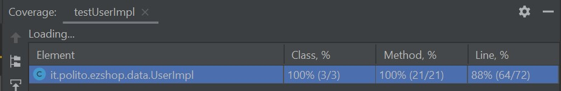
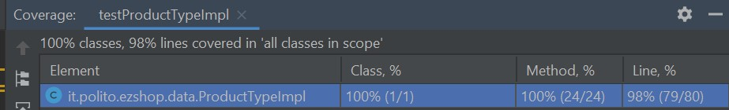

# Unit Testing Documentation

Authors:

Date:

Version:

# Contents

- [Black Box Unit Tests](#black-box-unit-tests)

- [White Box Unit Tests](#white-box-unit-tests)

# Black Box Unit Tests

    <Define here criteria, predicates and the combination of predicates for each function of each class.
    Define test cases to cover all equivalence classes and boundary conditions.
    In the table, report the description of the black box test case and (traceability) the correspondence with the JUnit test case writing the 
    class and method name that contains the test case>
    <JUnit test classes must be in src/test/java/it/polito/ezshop   You find here, and you can use,  class TestEzShops.java that is executed  
    to start tests
    >

    <We used a bottom-up testing strategy>

# Class UserImpl 

## Method isAllowedRole

**Criteria for method *isAllowedRole*:**

- Validity of the String parameter

**Predicates for method *isAllowedRole*:**

| Criterion                        | Predicate |
| -------------------------------- | --------- |
| Validity of the String parameter | Valid     |
|                                  | Invalid   |
|                                  | NULL      |
||Empty|

**Combination of predicates**:

|  Validity of the String parameter | Valid / Invalid | Description of the test case | JUnit test case |
|-------|-------|-------|-------|
| Valid                            |  V                      | admin_role="Administrator"   isAllowedRole(admin_role)   -> true|     testisAllowedRole()            |
| Invalid                          |  I                | admin_role="administrator"    isAllowedRole(admin_role)   -> false                 |  testisAllowedRole()  |
| Empty                            |  I               |  admin_role=""   isAllowedRole(admin_role)   -> false                 |  testisAllowedRole()  |
| NULL                             |  I                |  admin_role=null    isAllowedRole(admin_role)   -> false                 |   testisAllowedRole()|

## Methods canManageUsers

**Criteria for methods *CanManageUsers*:**

- Value of field role

**Predicates for methods *canManageUsers*:**

| Criterion                        | Predicate |
| -------------------------------- | --------- |
|Value of field role               | Administrator |
|                                  | Cashier   |
|                                  | ShopManager  |

**Combination of predicates**:

|  Validity of the String parameter | Valid / Invalid | Description of the test case | JUnit test case |
|-------|-------|-------|-------|
| Aministrator                          |  V                     |  user.setRole(admin_role)  user.canManageUsers()  -> true|     testcanManageUsers()|
| Cashier                               |  I               |  user.setRole(cashier_role)   user.canManageUsers()  -> false| testcanManageUsers() |
| ShopManager                           |  I               |  user.setRole(shop_manager_role)   user.canManageUsers()  -> false | testcanManageUsers() |

## Methods canManageProductList, canManageInventory, canManageAccounting

**Criteria for methods *canManageProductList, canManageInventory, canManageAccounting*:**

- Value of field role

**Predicates for methods *canManageProductList, canManageInventory, canManageAccounting*:**

| Criterion                        | Predicate |
| -------------------------------- | --------- |
|Value of field role               | Administrator |
|                                  | Cashier   |
|                                  | ShopManager  |

**Combination of predicates**:

|  Validity of the String parameter | Valid / Invalid | Description of the test case | JUnit test case |
|-------|-------|-------|-------|
| Aministrator                          |  V                     |  user.setRole(admin_role)   user.canManageProductList()  user.canManageInventory() user.canManageAccounting()  -> true|   testcanManageProductList() testcanManageInventory() testcanManageAccounting()  |
| Cashier                               |  V               |  user.setRole(cashier_role)    user.canManageProductList()  user.canManageInventory() user.canManageAccounting()  -> true|   testcanManageProductList() testcanManageInventory() testcanManageAccounting() |
| ShopManager                           |  I               |  user.setRole(shop_manager_role)    user.canManageProductList()  user.canManageInventory() user.canManageAccounting()  -> false| testcanManageProductList() testcanManageInventory() testcanManageAccounting()  |

## Methods canManageCustomers, canManageSaleTransactions, canManagePayments

**Criteria for methods *canManageCustomers, canManageSaleTransactions, canManagePayments*:**

- Value of field role

**Predicates for methods *canManageCustomers, canManageSaleTransactions, canManagePayments*:**

| Criterion                        | Predicate |
| -------------------------------- | --------- |
| Value of field role              | Administrator |
|                                  | Cashier   |
|                                  | ShopManager  |

**Combination of predicates**:

|  Validity of the String parameter | Valid / Invalid | Description of the test case | JUnit test case |
|-------|-------|-------|-------|
| Aministrator                          |  V                     |  user.setRole(admin_role)   user.canManageCustomers()  user.canManageSaleTransactions() user.canManagePayments()  -> true|     testcanManageCustomers() testcanManageSaleTransactions() testcanManagePayments()|
| Cashier                               |  V               |  user.setRole(cashier_role)    user.canManageCustomers()  user.canManageSaleTransactions() user.canManagePayments()  -> true|  testcanManageCustomers() testcanManageSaleTransactions() testcanManagePayments()|
| ShopManager                           |  V               |  user.setRole(shop_manager_role)    user.canManageCustomers()  user.canManageSaleTransactions() user.canManagePayments()  -> true|  testcanManageCustomers() testcanManageSaleTransactions() testcanManagePayments()|

# Class ProductTypeImpl 

## Method isValidCode

**Criteria for method *isValidCode*:**

- Validity of length String parameter productCode
- Validity of digits type of String parameter productCode
- Validity of digits sum String parameter productCode
- Validity of String parameter

**Predicates for method *isValidCode*:**

| Criterion                        | Predicate |
| -------------------------------- | --------- |
| Validity of length               | >=12 and <=14 |
|                                  | <12 or >14   |
| Validity of digits type         | is parsable Long   |
|                                  |nor parsable Long |
|Validity of digits sum            | Closest higher tens to sum calculation (x1 and x3), minus sum is equal to 3 |
|Validity of String parameter      | null|
|                                  |Empty|

**Combination of predicates**:

|  Validity of the String parameter |  Validity of length| Validity of digits type | Validity of digits sum  | Valid / Invalid | Description of the test case | JUnit test case |
|-------|-------|-------|-------|-------|-------|-------|
| Valid    |   >12 and <14     | is  parsable   | Valid   |  V                      | isValidCode("5701234567899")   -> true   | testisValidCode ()|       
| *  |   *      |  *        | Invalid |  I                | isValidCode("111111111111")   -> false                 |  testisValidCode () |
| *  |   *       |  is not parsable        | * |  I                | isValidCode("5701234a67899")   -> false                 | testisValidCode ()|
| *  |   >12 and <14       |  *     | * |  I                | isValidCode("570167899")   -> false | testisValidCode ()|
|Empty |   *      |  *       | * |  I                |isValidCode("")    -> false                 |   testisValidCode ()              |
|null |   *      |  *       | * |  I                | isValidCode(null)    -> false |   testisValidCode ()    |

## Method isValidLocation

**Criteria for method *isValidLocation*:**

- Validity of format ("number-character-number") String parameter location
- Validity of String parameter

**Predicates for method *isValidLocation*:**

| Criterion                        | Predicate |
| -------------------------------- | --------- |
| Validity of format               | format is "number-string-number" |
|                                  | wrong - usage or wrong element format (number/string)  |
|Validity of String parameter      | null|
|                                  |Empty|

**Combination of predicates**:

|  Validity of the String parameter |  Validity of format| Valid / Invalid | Description of the test case | JUnit test case |
|-------|-------|-------|-------|-------|
|Valid  | Valid format |  V | isValidLocation("3-a-2")    -> true | testisValidLocation ()|
|Valid  | Invalid format| I | isValidLocation("a-2-1")   isValidLocation("1b-3")   -> false  | testisValidLocation ()|
|Empty |   -    |  V              | isValidLocation("")    -> true  (location reset values)             |  testisValidLocation ()              |
|null  |  -     |  V              | isValidLocation(null)    -> true (location reset values)    |testisValidLocation ()|

# Class SaleTransactionImpl

## Method setTicketNumber

**Criteria for method *setTicketNumber*:**

- setTicketNumber parameter is a valid Integer object or null

**Predicates for method *setTicketNumber*:**

| Criterion                        | Predicate  |
| -------------------------------- | ---------- |
| Validity of Integer parameter    | Valid      |
|                                  | NULL       |

**Combination of predicates**:

| Validity of the Integer parameter | Valid / Invalid | Description of the test case | JUnit test case |
| --------------------------------- | --------------- | ---------------------------- | --------------- |
| Valid                             | V               | setTicketNumber(10) getTicketNumber().equals(10)  -> true | TestSaleTransactionImpl.testSetTicketNumber() |
| NULL                              | I               | setTicketNumber(10) setTicketNumber(null) getTicketNumber().equals(10)  -> true (not modified) | TestSaleTransactionImpl.testSetTicketNumber() |

## Method setPrice

**Criteria for method *setPrice*:**

- price parameter is a valid double base type

**Predicates for method *setPrice*:**

| Criterion                                     | Predicate  |
| --------------------------------------------- | ---------- |
| Validity of double parameter                  | Valid      |

**Combination of predicates**:

|  Validity of the double parameter | Valid / Invalid | Description of the test case | JUnit test case |
| --------------------------------- | --------------- | ---------------------------- | --------------- |
| Valid                             | V               | setPrice(4.99) getPrice().equals(4.99)  -> true | TestSaleTransactionImpl.testSetPrice() |

## Method setDiscountRate

**Criteria for method *setDiscountRate*:**

- discountRate parameter is a valid double base type

**Predicates for method *setDiscountRate*:**

| Criterion                                     | Predicate  |
| --------------------------------------------- | ---------- |
| Validity of double parameter                  | Valid      |

**Combination of predicates**:

|  Validity of the double parameter | Valid / Invalid | Description of the test case | JUnit test case |
| --------------------------------- | --------------- | ---------------------------- | --------------- |
| Valid                             | V               | setDiscountRate(0.15) getDiscountRate().equals(0.15)  -> true | TestSaleTransactionImpl.testSetDiscountRate() |

# Class TicketEntryImpl

## Method setBarCode

**Criteria for method *setBarCode*:**

- barCode parameter is a valid String object or null

**Predicates for method *setBarCode*:**

| Criterion                        | Predicate  |
| -------------------------------- | ---------- |
| Validity of String parameter     | Valid      |
|                                  | NULL       |

**Combination of predicates**:

| Validity of the String parameter  | Valid / Invalid | Description of the test case | JUnit test case |
| --------------------------------- | --------------- | ---------------------------- | --------------- |
| Valid                             | V               | setBarCode("5701234567899") getBarCode().equals("5701234567899")  -> true | TestTicketEntryImpl.testSetBarCode() |
| NULL                              | I               | setBarCode("5701234567899") setBarCode(null) getBarCode().equals("5701234567899")  -> true (not modified) | TestTicketEntryImpltestSetBarCode() |

## Method setProductDescription

**Criteria for method *setProductDescription*:**

- productDescription parameter is a valid String object or null

**Predicates for method *setProductDescription*:**

| Criterion                        | Predicate  |
| -------------------------------- | ---------- |
| Validity of String parameter     | Valid      |
|                                  | NULL       |

**Combination of predicates**:

| Validity of the String parameter  | Valid / Invalid | Description of the test case | JUnit test case |
| --------------------------------- | --------------- | ---------------------------- | --------------- |
| Valid                             | V               | setProductDescription("ZZZ") getProductDescription().equals("ZZZ")  -> true | TestTicketEntryImpl.testSetProductDescription() |
| NULL                              | I               | setProductDescription("ZZZ") setProductDescription(null) getBarCode().equals(ZZZ)  -> true (not modified) | TestTicketEntryImpl.testSetProductDescription() |

## Method setAmount

**Criteria for method *setAmount*:**

- amount parameter is a valid int base type

**Predicates for method *setAmount*:**

| Criterion                                     | Predicate  |
| --------------------------------------------- | ---------- |
| Validity of int parameter                     | Valid      |

**Combination of predicates**:

| Validity of the int parameter     | Valid / Invalid | Description of the test case | JUnit test case |
| --------------------------------- | --------------- | ---------------------------- | --------------- |
| Valid                             | V               | setAmount(10) getAmount().equals(10)  -> true | TestTicketEntryImpl.testSetAmount() |

## Method setPricePerUnit

**Criteria for method *setPricePerUnit*:**

- pricePerUnit parameter is a valid double base type

**Predicates for method *setPricePerUnit*:**

| Criterion                                     | Predicate  |
| --------------------------------------------- | ---------- |
| Validity of double parameter                  | Valid      |

**Combination of predicates**:

| Validity of the double parameter  | Valid / Invalid | Description of the test case | JUnit test case |
| --------------------------------- | --------------- | ---------------------------- | --------------- |
| Valid                             | V               | setPricePerUnit(2.49) getPricePerUnit().equals(2.49)  -> true | TestTicketEntryImpl.testSetPricePerUnit() |

## Method setDiscountRate

**Criteria for method *setDiscountRate*:**

- pricePerUnit parameter is a valid double base type

**Predicates for method *setDiscountRate*:**

| Criterion                                     | Predicate  |
| --------------------------------------------- | ---------- |
| Validity of double parameter                  | Valid      |

**Combination of predicates**:

| Validity of the double parameter  | Valid / Invalid | Description of the test case | JUnit test case |
| --------------------------------- | --------------- | ---------------------------- | --------------- |
| Valid                             | V               | setDiscountRate(0.50) getDiscountRate().equals(0.50)  -> true | TestTicketEntryImpl.testSetDiscountRate() |

# Class ReturnTransactionImpl

## Method setReturnId
**Criteria for method *setReturnId*:**

- returnId parameter is a valid Integer object or null

**Predicates for method *setReturnId*:**

| Criterion                        | Predicate  |
| -------------------------------- | -----------|
|Validity of Integer parameter     | Valid      |
|                                  | NULL       |

**Combination of predicates**:

|  Validity of the Integer parameter| Valid / Invalid | Description of the test case | JUnit test case |
|-----------------------------------|-----------------|------------------------------|-----------------|
|Valid                              |V                |setReturnId(100) getReturnId( ).equals(100)  -> true|testReturnTransactionImpl.testSetReturnId()|
|NULL                               |I                |setRetutnId(12) setReturnId(null) getReturnId( ).equals(12)  -> true(not modified)|testReturnTransactionImpl.testSetReturnId( )|

## Method setState

**Criteria for method *setState*:**

- state parameter is a valid String object or null
- value of the String object is INPROGRESS, CLOSED or PAYED

**Predicates for method *setState*:**

| Criterion                                     | Predicate  |
| ----------------------------------------------| -----------|
|Validity of String parameter                   | Valid      |
|                                               | NULL       |
|Value of String parameter                      | Empty      |
|                                               | INPROGRESS |
|                                               | CLOSED     |
|                                               | PAYED      |
|                                               | Other value|

**Combination of predicates**:

|  Validity of the String parameter |Value of String Parameter| Valid / Invalid | Description of the test case | JUnit test case |
|-----------------------------------|-------------------------|-----------------|------------------------------|-----------------|
|NULL                               |*                        |I                |setState("INPROGRESS") setState(null) getState( ).equals("INPROGRESS")  -> true(not modified)|testReturnTransactionImpl.testSetState( )|
|Valid                              |Empty                    |I                |setState("")  -> exception thrown|testReturnTransactionImpl.testSetState( )|
|"                                 |INPROGRESS               |V                |setState("INPROGRESS") getState( ).equals("INPROGRESS)  -> true|testReturnTransactionImpl.testSetState( )|
|"                                  |CLOSED                   |V                |setState("CLOSED") getState( ).equals("CLOSED")  -> true|testReturnTransactionImpl.testSetState( )|
|"                                  |PAYED                    |V                |setState("PAYED") getState( ).equals("PAYED")  -> true|testReturnTransactionImpl.testSetState( )|
|"                                  |Other Value              |I                |setState("rAnDoM VaLuE")  -> exception thrown|testReturnTransactionImpl.testSetState( )|

## Method setAmount

**Criteria for method *setAmount*:**

- amount parameter is a valid Double object or null

**Predicates for method *setAmount*:**

| Criterion                                     | Predicate  |
| ----------------------------------------------| -----------|
|Validity of Double parameter                   | Valid      |
|                                               | NULL       |

**Combination of predicates**:

|  Validity of the Double parameter | Valid / Invalid | Description of the test case | JUnit test case |
|-----------------------------------|-----------------|------------------------------|-----------------|
|Valid                              |V                |setAmount(17.50) getAmount( ).equals(17.50)  ->true|testReturnTransactionImpl.testSetAmount( )|
|NULL                               |I                |setAmount(22.30) setAmount(null) getAmount( ).equals(22.30)  -> true(not modified)|testReturnTransactionImpl.testSetAmount( )|

## Method setPaymentType

**Criteria for method *setPaymentType*:**

- paymentType parameter is a valid String object or null
- value of the String object is CARD or CASH

**Predicates for method *setPaymentType*:**

| Criterion                                     | Predicate  |
| ----------------------------------------------| -----------|
|Validity of String parameter                   | Valid      |
|                                               | NULL       |
|Value of String parameter                      | Empty      |
|                                               | CARD       |
|                                               | CASH       |
|                                               | Other value|

**Combination of predicates**:

|  Validity of the String parameter |Value of String Parameter| Valid / Invalid | Description of the test case | JUnit test case |
|-----------------------------------|-------------------------|-----------------|------------------------------|-----------------|
|NULL                               |*                        |I                |setPaymentType("CARD") setPaymentType(null) getPaymentType( ).equals("CARD")  -> true(not modified)|testReturnTransactionImpl.testSetPaymentType( )|
|Valid                              |Empty                    |I                |setPaymentType("")  -> exception thrown|testReturnTransactionImpl.testSetPaymentType( )|
|"                                  |CARD                     |V                |setPaymentType("CARD") getPaymentType( ).equals(null)  -> true|testReturnTransactionImpl.testSetPaymentType( )|
|"                                  |CASH                     |V                |setPaymentType("CASH") getPaymentType( ).equals(null)  -> true|testReturnTransactionImpl.testSetPaymentType( )|
|"                                  |Other Value              |I                |setPaymentType("sOmE sTuFF")  -> exception thrown|testReturnTransactionImpl.testSetPaymentType( )|

# Class BalanceOperationImpl

## Method setBalanceId
**Criteria for method *setBalanceId*:**

- balanceId parameter is a valid int base type

**Predicates for method *setBalanceId*:**

| Criterion                                     | Predicate  |
| ----------------------------------------------| -----------|
|Validity of int parameter                      | Valid      |

**Combination of predicates**:

|  Validity of the int parameter    | Valid / Invalid | Description of the test case | JUnit test case |
|-----------------------------------|-----------------|------------------------------|-----------------|
|Valid                              |V                |setBalanceId(27) getBalanceId( ).equals(27)  -> true|testBalanceOperationImpl.testSetBalanceId( )|

## Method setDate

**Criteria for method *setDate*:**

- date parameter is a valid LocalDate object or null

**Predicates for method *setDate*:**

| Criterion                                     | Predicate  |
| ----------------------------------------------| -----------|
|Validity of LocalDate parameter                | Valid      |
|                                               | NULL       |

**Combination of predicates**:

|Validity of the LocalDate parameter| Valid / Invalid | Description of the test case | JUnit test case |
|-----------------------------------|-----------------|------------------------------|-----------------|
|Valid                              |V                |LocalDate l = LocalDate.now( ) setLocalDate(l) getLocalDate( ).equals(l)  -> true|testBalanceOperationImpl.testSetDate( )|
|NULL                               |I                |LocalDate l = LocalDate.now( ) setLocalDate(l) setLocalDate(null) getLocalDate( ).equals(l)  -> true(not modified)|testBalanceOperationImpl.testSetDate( )|

## Method setMoney

**Criteria for method *setMoney*:**

- money parameter is a valid double base type

**Predicates for method *setMoney*:**

| Criterion                                     | Predicate  |
| ----------------------------------------------| -----------|
|Validity of double parameter                   | Valid      |

**Combination of predicates**:

|  Validity of the double parameter | Valid / Invalid | Description of the test case | JUnit test case |
|-----------------------------------|-----------------|------------------------------|-----------------|
|Valid                              |V                | setMoney(23.50) getMoney( ).equals(23.50)  -> true|testBalanceOperationImpl.testSetMoney( )|

## Method setType

**Criteria for method *setType*:**

- type parameter is a valid String object or null

**Predicates for method *setType*:**

| Criterion                                     | Predicate  |
| ----------------------------------------------| -----------|
|Validity of String parameter                   | Valid      |
|                                               | NULL       |

**Combination of predicates**:

|  Validity of the String parameter | Valid / Invalid | Description of the test case | JUnit test case |
|-----------------------------------|-----------------|------------------------------|-----------------|
|Valid                              |V                |setType("CREDIT") getType( ).equals("CREDIT")  -> true|testBalanceOperationImpl.testSetType( )|
|NULL                               |I                |setType("CREDIT") setType(null) getType( ).equals("CREDIT")  -> true(not modified)|testBalanceOperationImpl.testSetType( )|

# White Box Unit Tests

### Test cases definition
    
    <JUnit test classes must be in src/test/java/it/polito/ezshop>
    <Report here all the created JUnit test cases, and the units/classes under test >
    <For traceability write the class and method name that contains the test case>

| Unit name | JUnit test case |
|---------|-------|
| UserImpl | testUserImpl/testUserConstructorGetters() |
| ProductTypeImpl | testProductTypeImpl/testProductConstructorGetters() |

### Code coverage report

### Loop coverage analysis

    <Identify significant loops in the units and reports the test cases
    developed to cover zero, one or multiple iterations >

|Unit name | Loop rows | Number of iterations | JUnit test case |
|---|---|---|---|
| ProductTypeImpl | 74-77 | 0 | testProductImpl/testisValidCode() |
| |  | 1+ | testProductImpl/testisValidCode() |

