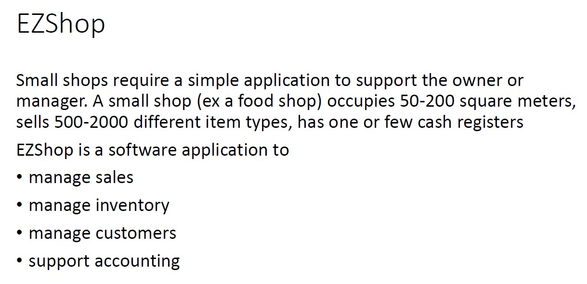
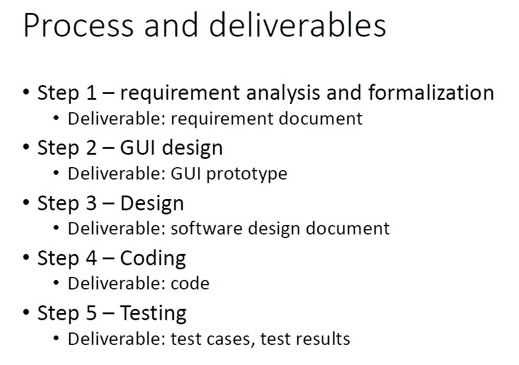

# EZShop-Software-Engineering-Project

## The aim of this project was to develop a software to support a small shop. The focus of the project was on the organization, design, testing and team coordination other than the coding part.    Below the initial assignment and the various steps followed during the project are reported.

  

